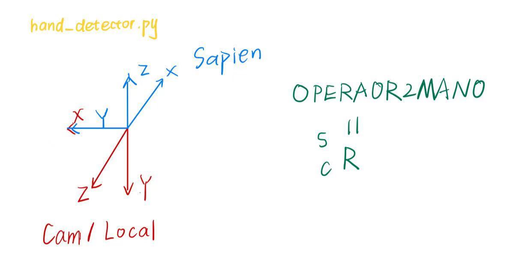

## Setup
1. 在安装的`wilor_mini`包中，将`site-packages/wilor_mini/pipelines/wilor_hand_pose3d_estimation_pipeline.py` 中的scaled_focal_length修改自身摄像头的fx

2. 安装ManiSkill
    ```shell
    cd thirdparty/ManiSkill
    pip install -e .
    ```
    maniskill还需要安装[Vulkan](https://maniskill.readthedocs.io/en/latest/user_guide/getting_started/installation.html#vulkan)

   


## Commands for running the example 
```shell
python3 push_cube.py --arm franka --hand panda --hand-type left
python3 push_cube.py --arm xarm6 --hand allegro --hand-type right
python3 push_cube.py --arm xarm7 --hand allegro --hand-type right
python3 push_cube.py --arm xarm7 --hand leap --hand-type right
python3 push_cube.py --arm xarm7 --hand shadow --hand-type right
```

## pipeline
以`xarm7_shadow_right`为例：
1. 添加urdf
    - 在`thirdparty/ManiSkill/mani_skill/assets/robots/xarm7`中，添加`xarm7_shadow_right.urdf`
    - urdf文件命名遵循`arm_hand_handtype`的规范
2. 添加`agent`类
    - 在`thirdparty/ManiSkill/mani_skill/agents/robots/xarm7`中，创建`xarm7_shadow.py`(可先直接复制一个其它的机器人作为template)
    - 修改类名，如`XArm7Shadow`, 规范命名uid(遵循`arm_hand_handtype`的规范), 如`xarm7_shadow_right`
    - `urdf_config=dict(...` 里的link是在修改材料的摩擦力，如`thtip`就是leap的指尖link, 需修改为对应机器手的link名称
    - 设置`self.arm_joint_names`，`self.hand_joint_names`（这个可以通过'tests/loader.py'加载对应的urdf文件查看）
    - 设置keyframes中`rest`帧的qpos，这里注意qpos维度要和前面的查看的activate joint(arm+hand)数量一致
    - 设置`self.ee_link_name`，这个主要看task需不需要用到了，像`PushCube-v1`这个环境就需要用到这个来计算奖励
    - 在`thirdparty/ManiSkill/mani_skill/assets/robots/xarm7`的`__init__.py`中import一下这个类，这样才能注册这个agent
3. 在对应的任务环境中添加该机器人，这里以`PushCube-v1`为例
    - 在`thirdparty/ManiSkill/mani_skill/envs/tasks/tabletop/PushCube-v1.py`中，import刚刚创建的agent类，分别在`SUPPORTED_ROBOTS`和`agent`属性中添加上类和uid
4. 添加对应的config文件
    - 在`dex_retargeting/configs/manitask/xarm7`下创建`leap_right.yml`(可以参考dex_retargeting/configs/manitask/teleop中相同机器手的)，注意命名为`arm/hand_handtype`,然后修改urdf路径，add_dummy_joint置False
5. 修改`dex_retargeting/constants_mani.py`，主要用于寻找各个config文件什么的
    - 在ArmName，HandName，HAND_NAME_MAP，ARM_NAME_MAP添加对应的arm和hand
    - LINK_BASE为机器人的root_link，如果有新的arm需要添加
6. 可选：为了让机器人最开始求解qpos的时候可以顺利求解，我们可以给个warm_start
    - 在主程序中调用了`dex_retargeting/seq_retarget.py`中的warm_start_manitask()，我们可以先不做修改然后跑一次，在主程序中把retargeting.retarget(ref_value)解算出来的qpos打印出来，手腕什么的旋转几下让那个机械手match上，选一个比较贴合的姿势记录下qpos(由于我一般是手掌心朝向摄像头开始的，所以我选择这个姿势)，在warm_start_manitask()中进行赋值


## Tips
1. 相机设置在`thirdparty/ManiSkill/mani_skill/envs/tasks/tabletop/pick_cube.py`中的`_default_human_render_camera_configs()`可修改各种参数
2. 每个episode重置的机器人、物体和目标点的位置量在`thirdparty/ManiSkill/mani_skill/envs/tasks/tabletop/pick_cube.py`中的`_initialize_episode()`可修改，其中机器人需进入`self.table_scene.initialize(env_idx)`中
3. hand_detector中的`points[:,2] = points[:,2] + 0.08 points[:,0] = points[:,0] + 0.2` 是我们映射过去的第一帧对应的机器手所在位置，不过注意这里的0.08和0.2在optimizer中还会乘以一个config中的scaling factor，这个scaling factor是为了匹配人手大小和机器手大小的。这个初始帧对应的初始位置求解出来的qpos只要和前面说的_initialize_episode()所设定的Sapien中设置的qpos不能完全对上，就会有跳变存在。
4. config文件在`dex_retargeting/configs/manitask/panda_gripper_left.yml`下，主要是配置一些retargeting求解的参数
5. 如果对原项目`dex-retargeting`提供的三种求解器感兴趣，可前往wilor_mini/README.md中查看



